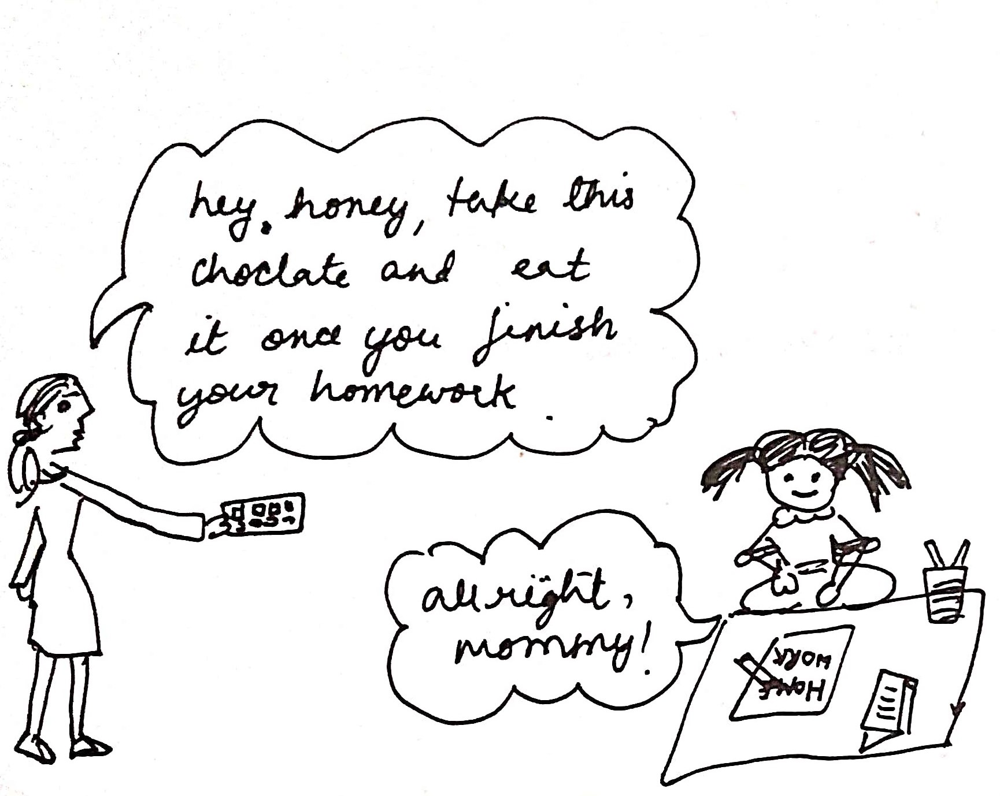
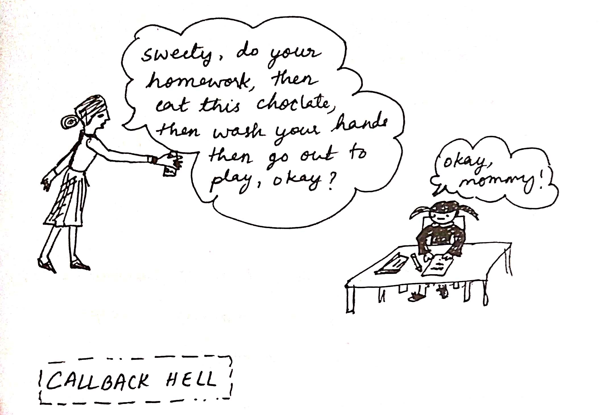
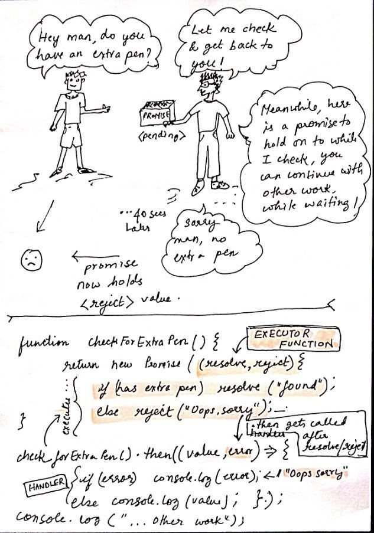

>Stop waiting, start doing!
>-Unknown

Javascript is inherently synchronous, i.e. it runs only one line of code at a time and in a sequential manner. This means if a task has a long wait-time, e.g waiting for a network call to return a response, it can block the whole program for a while. Also while waiting, no other task can run, which is very inefficient.

Asynchronicity is when multiple tasks can be dome simulteneously, for instance, while the the program waits for the response of a network call, it can do some other task like display some graphics or compute some numbers or something else. This is made possible through **asynchronous programming**.

One of the ways to achieve this is via **Callbacks**. Functions that can take a while is passed an extra argument, a callback function. Once this slow function is called it starts its task and when it finishes, the callback function is called inside it.

###Callbacks



```javascript
function doHomework( questions, chocolate, eatChocolate ) {
 //do homework stuff
 .
 .
 eatChocolate(chocolate); 
}
doHomework(questions, chocolate, eatChocolate);
```

###Problem with Callbacks? - Callback Hell 



```javascript
doHomework(questions, function(){
	eatChocolate(chocolate, function(){
		washHands(soap, function(){
			play();
		});
	});
});
```
Above example has only three nested functions but it can go on and on causing difficult to read code.

To resolve this problem we have **Promises**.

###Promise

A promise is a simple javascript object with mutable state i.e the value it holds changes. When a promise is first created, its state is `pending` and the value it holds is _undefined_ . Later when the promise resolves to a value or gets rejected and returns, the handler passed to `.then()` gets executed.   



On executing, when the interpreter reached this line `checkForExtraPen().then`

-  it puts the  HANDLER we passed into .then() , in the MICROTASK QUEUE.

-  it executes the EXECUTOR FUNCTION [that we passed to new Promise()].

-  executor function calls reject() and populates promise object with information passed to the reject call ie. "Oops Sorry!"

-  interpreter goes to next like and prints "other work.."

-  it then takes out the handler from microtask queue and executes it

-  the `value` passed to the handler is information returned from resolve(). In our case it is _undefined_. We get `error` because our promise was rejected, which is printed out "Oops Sorry!"

And this concludes our Promise story.


