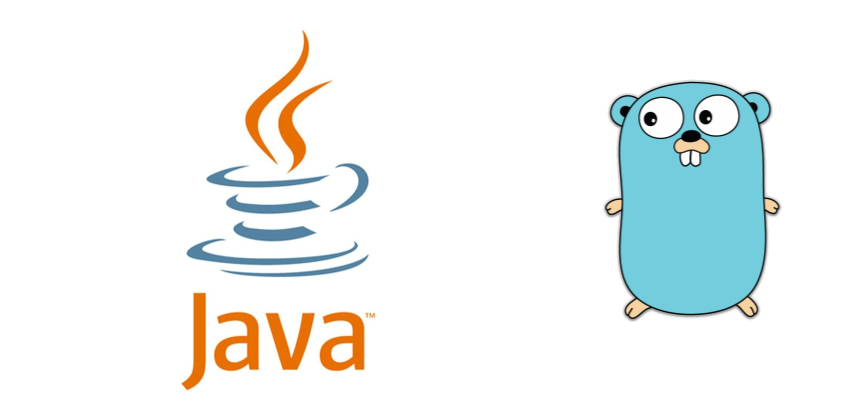

Java is still the  go-to language for large-scale enterprise software development due to its mature ecosystem of libraries and frameworks targetted to the enterprise,strong developer community, durability from having been tried and tested in production environments for over two decades, scalability and ease of integration, its ability to evolve over time and keep adapting to modern best practices and many more reasons.

But considering the fast changing landscape of software development, it is necessary for any software engineer to keep adding new tools to their developer toolbox, and learning a new language can sometimes broaden one's perspective and also improve their abilities when working with Java as well.

Go or Golang is a language that can be quite fun and useful to learn in this case. Go was designed originally as more of a systems-level programming language with features of C/C++ but without their problems. It takes the best from them and Java to give you a better language to work with. Go is simple to learn, fast, is slightly more opinionated about best practices for writing clean and efficient code, handles concurrency really really well and Go code is quite easy to reason about unlike Java.

