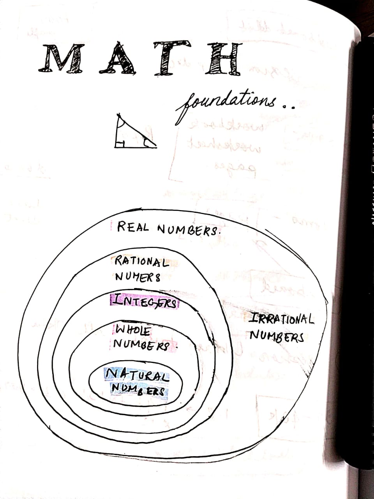

I have been doing math in my free time for the past couple of months, and I wanted to take a moment to reflect and note down a few thoughts about it.

### Why Math?

What drives me to start from scratch with math foundations, even when there’s no immediate career benefit? *Mental health*.

Learning has become an anchor for me. It keeps my mind engaged, preventing boredom, procrastination, and unhealthy fixations from creeping in. Since mental well-being has been my top priority for a while, math has naturally also taken priority.

### How I have stayed consistent (even when I am not)

While I haven't been very consistent in practicing math daily, I keep picking it back up again even if its only for a few minutes to solve a couple of problems or revise a few concepts. 

One thing that helps is journaling my learnings on GitHub. It allows me to review concepts quickly - I can just open the repo on my phone and give it a quick read whenever I feel like it. 

I also use LLMs like chatGPT to generate review problems to solve, based on what I have learned. I am not consistent with this but I think this is a great way to do spaced repetition without much effort. Solving structured problems and making little bits of progress always feels gratifying and fulfilling, and makes it slightly easier for me to keep coming back to studying math.

### Some resources I use

- [Khan Academy](https://khanacademy.com) – This has been great for doing assessments for any particular topic and figuring out weaknesses.
- [OpenStax Books](https://openstax.org/subjects/math) – My current go-to primary resource for math foundations.
- [Math Stack Exchange](https://math.stackexchange.com/) – A fun place to hang out and read about urban legends in math.
- [OpenNote](https://opennote.me/) – An AI math tutor I have enjoyed trying out.
- [Open Library](https://openlibrary.org) – I have sometimes borrowed and read math books from here.

I primarily rely on textbooks, but I supplement them with LLMs, videos, and other formats to keep things engaging.

### Finding the Charm in Math

Sometimes, to mix things up and make the learning process feel more alive, I will dive into the history of mathematics - how certain topics emerged or how it evolved in time and the fascinating stories around them. For instance, how Newton and Leibniz were rivals in mathematics and fought over credit for who invented calculus first was quite dramatic and interesting to read about. Discovering these delightful anecdotes and historical moments makes studying math even more engaging and helps deal with any drops in motivation for me.

### Going forward

So far, learning math has been interesting. I am currently working through High-school Algebra and then will pick pre-calculus topics next. I am excited to tackle more challenging problems and see where this journey takes me.

----

I can be reached at <debamitra.mukherjee@gmail.com> , or connect with me on [twitter]( https://twitter.com/debamitra_) 

Thanks for reading, hope you enjoyed it. 

