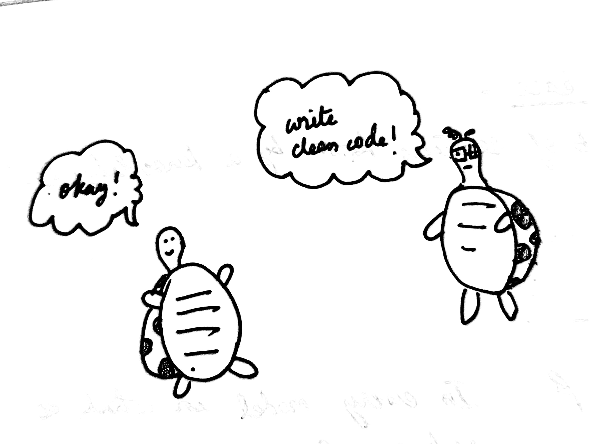

When I joined my current role three and a half years ago, I was coming out of a "sabbatical" which was just me stepping back for a bit. During those months, I spent some time re-evaluating my career, reflecting on past mistakes and many missed opportunities. I had left my last job because it felt meaningless, and I wasn’t doing it justice. So, when I got this offer, I grabbed it eagerly, ready to get back to work and earn a monthly paycheck again. Watching my bank balance deplete (rather swiftly) over the past few months was very heartbreaking and I missed the dopamine hit from those month-end "your account has been credited.." messages. And the rent and bills weren’t going to pay themselves, were they?

But let’s get back to talking about mentoring.

### My First Project at the new job

I joined in a senior developer role, and my first project was to build a web portal, essentially, a small internal tool for a client. It was a small project with a team of four.

I was paired with a new backend developer who was a fresher, which quickly turned into me unofficially guiding him. He was entirely new to the field, so I guided him on the basics of web development, setting up APIs, and structuring a database, while he worked to skill up on the tech stack independently. I handled most of the initial architecture, the DB schema, and feature development, then handed him manageable tasks to start with.

### Watching Someone Grow

Mentoring my teammate was quite a journey. He was new to python and web development, and we spent many late nights debugging together, especially before milestone releases. But he was ambitious, a quick learner, and super detail-oriented. Watching him go from seeking help with minor issues to thinking critically and taking charge was incredibly rewarding. Over time, he started taking ownership of his work, coming up with his own ideas, and suggesting alternate solutions when he saw a better way.

At some point in the project he took on the end-to-end design and implementation of a complex feature all on his own. Seeing him confidently manage the project and  become someone reliable was gratifying.

### My Mentoring Style

I would describe my mentoring style as pretty hands-off, focusing more on providing a framework for juniors to independently learn and grow, rather than spoon-feeding them step by step. Part of this comes from my own experience. Early in my career, I often felt lost, not fully understanding how things worked in organizations, how to contribute effectively, whether I was making any impact or even what my role really meant. I lost confidence early on and often felt crushed under the weight of "corporate". Having a senior to provide insight on these things would have been invaluable.

I try to be that kind of colleague for my junior teammates, especially for those who might benefit from a space to grow and find their bearings.

### The Impact of Mentoring

Since that first project, I’ve mentored a few more engineers. Looking back, I feel the most valuable thing I offered them wasn’t technical guidance but a safe space to learn and grow. I would guide them in the beginning—set up the architecture, explain the structure, answer questions—but then afterwards  I will  slowly step back, leaving them room to figure things out and problem-solve independently. And most of the time, they surprised me by doing even better than I expected.

I wanted them to grow quickly, take on more responsibility, and feel competent and confident. So, I tried to create a foundation for them but left plenty of room for experimenting and even making mistakes. I believe every developer needs space to develop their own style, not just copy what they are told.

### Ending thoughts

To be honest, mentoring isn’t something I consistently enjoy. I am introverted, so mentoring can sometimes feel exhausting, especially when it stretches on for long hours. It takes effort for me to stay as engaged in the process as I do with coding itself. Coding, in many ways, is still the part of the job I find most satisfying. But mentoring in small amounts brings its own type of reward. It’s a different satisfaction, knowing that I am helping someone grow and maybe even giving them the kind of support I wish I had early on. In the end, that’s what makes it worthwhile.

----

I can be reached at <debamitra.mukherjee@gmail.com> , or connect with me on [twitter]( https://twitter.com/debamitra_) 

Thanks for reading, hope you enjoyed it. 

