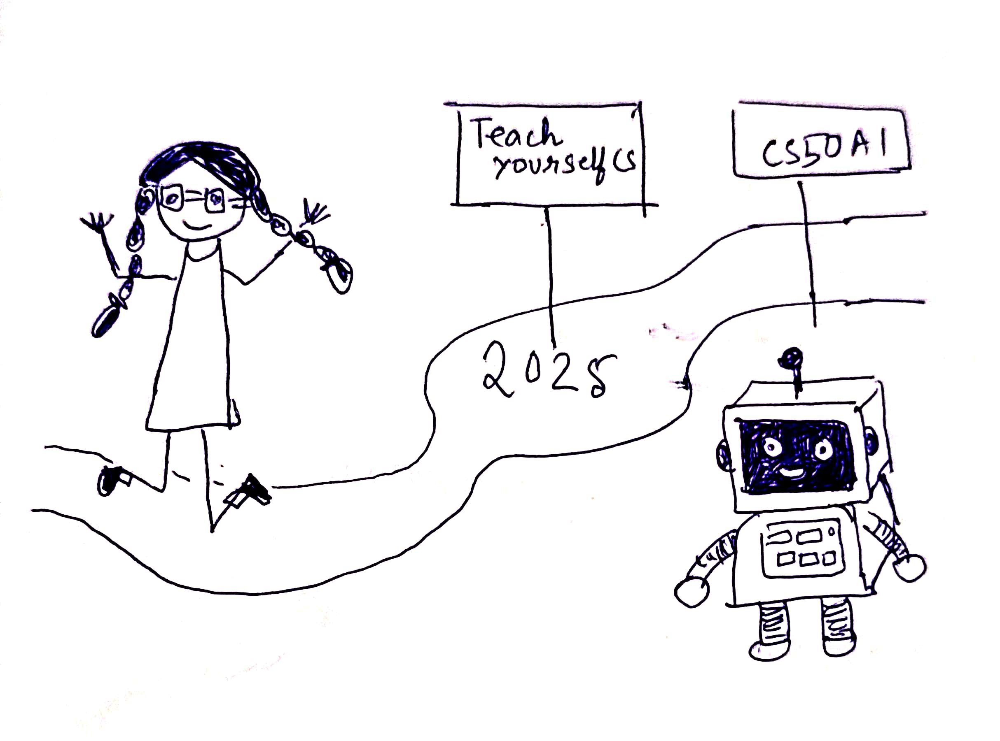

2024 is about to end so here’s a tiny retrospective (this is my third reflective piece in 3 months, I may turn into a mirror soon if I reflect any more).  

### Highlight of the Year.. 

The most important thing for me was getting started with my self-learning journey. I started with *Nand2Tetris Part 1* which is the first half of the book "The Elements of Computing Systems". Then I moved to Operating Systems theory by reading *OSTEP* and exploring the XV6 kernel. I started with the intent to maybe build an OS from scratch but eventually let that idea go as it didn’t catch my interest deeply enough at the time. My goal mainly was to develop better mental models and strengthen my understanding of CS fundamentals. 

I also experimented with keeping a study journal to track my progress. It’s still a bit inconsistent and unstructured, but it’s been fun to document my journey and try out different approaches. 

In the past couple of months, I have also started writing more. I published two short reflective articles on my personal blog, after a great deal of procastination. I count that as a big win. 

### Work and Other Things.. 

This year, I was promoted to a **Technical Lead** role which came with additional tasks and more responsibilities. 

Some things from work:  
    1. Being assigned as a dotted-line manager for 11 team members.      
    2. Leading a full-stack training program for freshers and lateral hires.  
    3. Conducting 77 interviews this year (yes, I went and counted!).  
    4. Giving a tech talk to the product engineering team (I was nervous for this).  

### Intentions for 2025.. 

Who knows what will happen in the future, but here are some plans I have for 2025:  
    1. Grow in career.  
    2. Complete the **AI CS50 course**.  
    3. Pick 2 more *TeachYourselfCS* topics to study.  
    4. Work on a side project.  

So there it is. I hope to study more, write more, build more, and be happy more. I am grateful that this year set the foundation and hope to continue in the next year with more exciting things to look forward to.

----

I can be reached at <debamitra.mukherjee@gmail.com> , or connect with me on [twitter]( https://twitter.com/debamitra_) 

Thanks for reading, hope you enjoyed it. 

